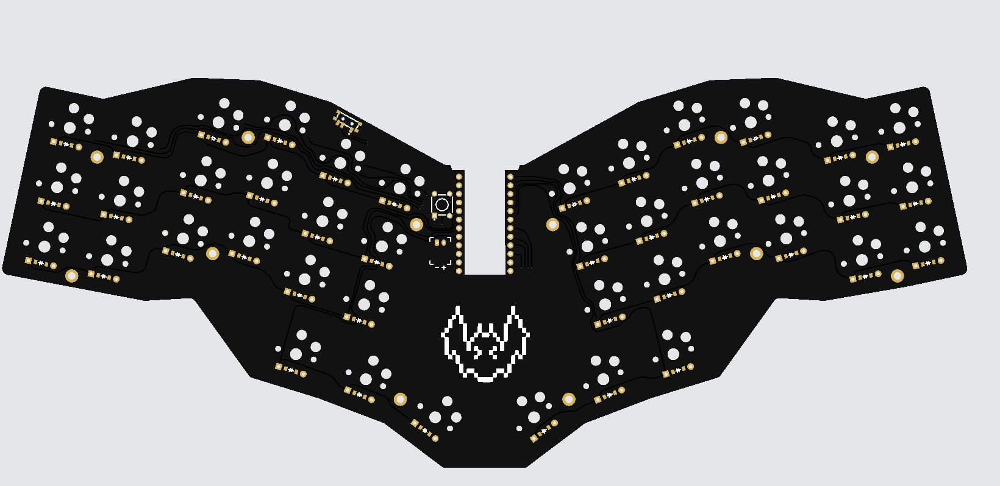

### Goals
- small and thin portable board that could sit on my laptop
- keep the layout I am used to


## Small guide

### If you want to modify or build yourself
1. Clone the repo

```bash
git clone --recursive <this repo>
```
recursive for the submodule containing extra footprints   

2. Run ergogen which will build the pcbs
```bash
npm install -g ergogen
ergogen .
```
3. Go into the output directory and open it with pcbnew (KiCAD)
4. Do the routing / modifications
5. Upload the gerbers to a pcb manufacturer
6. Follow the following guide about assembly


### Or just build the premade version
1. Zip the gerber directory
2. Upload to a pcb manufacturer
3. Assemble the board

#### Bom
- 42 choc switches 
- 42 smd diodes
- 1 nice nano v2
- 1 reset switch
- 1 on / off switch
- 42 keycaps
- (optionally) print plate and case


### Preview: 
coming as soon as I get the pcbs   




### Notes
- Thanks to [dustdfg](https://dustdfg.itch.io/pixel-art-bat-1bit) for the pixel art

